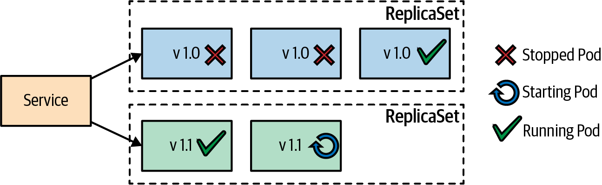
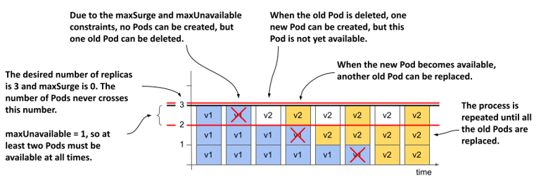
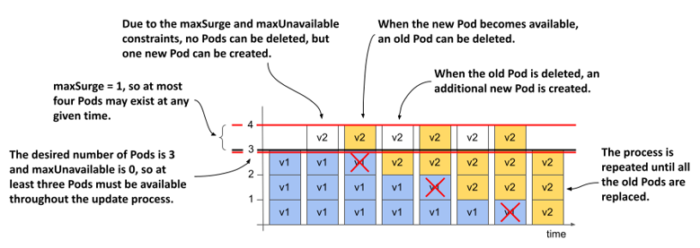
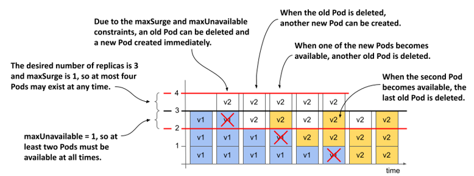
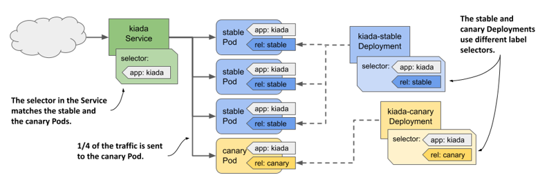
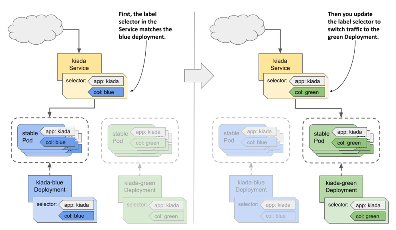
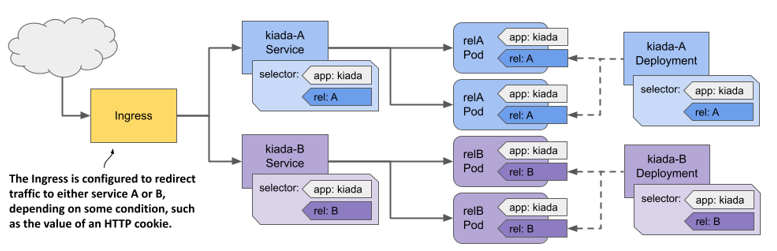

# Deployments in Kubernetes

Deployments in Kubernetes are a powerful way to manage and scale applications. They provide a declarative approach to defining and managing the lifecycle of application deployments. In this README, we will explore different deployment strategies, the advantages of using deployments, and best practices.

## Deployment Strategies

1. **Rolling Updates**: This strategy allows for seamless updates to your application by gradually replacing old instances with new ones. It ensures that your application remains available during the update process.

2. **Blue-Green Deployments**: With this strategy, you maintain two identical environments, the "blue" and the "green" environment. You deploy new versions to the "green" environment and switch traffic to it once it's ready. This approach minimizes downtime and allows for easy rollback if any issues arise.

3. **Canary Deployments**: Canary deployments involve gradually rolling out new versions to a subset of users or traffic. This allows you to test the new version in a controlled manner before rolling it out to the entire user base.

4. **A/B Testing**: A/B testing involves comparing two versions of an application to determine which one performs better. By splitting traffic between the two versions, you can gather data and make informed decisions to improve user experience.

5. **Recreate Deployments**: This strategy involves terminating all instances of the old version before deploying the new version. While it may result in downtime, it ensures a clean and consistent deployment.

## Advantages of Using Deployments

- **Rollback Capability**: Deployments provide an easy way to roll back to a previous version in case of issues or failures. This ensures that your application remains stable and minimizes downtime.

- **Scalability**: Deployments allow you to scale your application horizontally by easily increasing or decreasing the number of replicas. This ensures that your application can handle increased traffic or demand.

- **Self-Healing**: Kubernetes deployments automatically monitor the health of your application and restart any failed instances. This ensures that your application remains highly available and resilient.

## Best Practices

1. **Version Control**: Keep your deployment configurations under version control to track changes and easily revert if needed.

2. **Health Checks**: Define appropriate health checks for your application to ensure that Kubernetes can accurately determine the health of your instances.

3. **Resource Limits**: Set resource limits for your deployments to prevent resource contention and ensure fair allocation of resources within the cluster.

4. **Pod Disruption Budgets**: Define pod disruption budgets to control the impact of disruptions during updates or maintenance activities.

5. **Monitoring and Logging**: Implement monitoring and logging solutions to gain visibility into your deployments and quickly identify and troubleshoot any issues.

## Example Manifest File

Here is an example manifest file for a deployment in Kubernetes:

```yaml
apiVersion: apps/v1
kind: Deployment
metadata:
  name: my-app-deployment
spec:
  replicas: 3
  selector:
    matchLabels:
      app: my-app
  template:
    metadata:
      labels:
        app: my-app
    spec:
      containers:
      - name: my-app-container
        image: my-app-image:latest
        ports:
        - containerPort: 8080
```

## Using Deployments with kubectl

To view logs of a deployment, you can use the following command:

```shell
kubectl logs deployment/my-app-deployment
```

To expose ports of a deployment, you can use the following command:

```shell
kubectl expose deployment my-app-deployment --type=LoadBalancer --port=8080
```

Remember to replace `my-app-deployment` with the name of your deployment.


## Rolling Updates with Deployments

The RollingUpdate strategy minimizes downtime by gradually replacing old containers with new ones across ReplicaSets. It allows for controlled rollout rates through `maxSurge` and `maxUnavailable` settings, which dictate the number of Pods that can be added or removed, calculated as absolute numbers or percentages of desired replicas. Defaults for both are 25%. The `minReadySeconds` parameter defines how long a Pod must be ready before it's considered available, aiding in stability and troubleshooting during updates.



### Using maxSurge and maxUnavailable

####  Pods are replaced when maxSurge is 0 and maxUnavailable is 1



#### Pods are replaced when maxSurge is 1 and maxUnavailable is 0



#### Pods are replaced when both maxSurge and maxUnavailable are 1



### Canary Deployments with Deployments

Canary deployments are a way to test new versions of an application in production by gradually rolling out the new version to a subset of users. This allows you to validate the new version in a controlled manner before rolling it out to the entire user base. In Kubernetes, you can achieve canary deployments using multiple strategies, such as traffic splitting, custom resource definitions, or service meshes.



### Blue-Green Deployments with Deployments

Blue-green deployments involve maintaining two identical environments, the "blue" and the "green" environment. You deploy new versions to the "green" environment and switch traffic to it once it's ready. This approach minimizes downtime and allows for easy rollback if any issues arise. In Kubernetes, you can achieve blue-green deployments using multiple strategies, such as service selectors, Ingress controllers, or custom resource definitions.




### A/B Testing with Deployments

A/B testing is a way to compare two versions of an application to determine which one performs better. In Kubernetes, you can achieve A/B testing using multiple strategies, such as traffic splitting, custom resource definitions, or service meshes. By comparing the performance of different versions of your application, you can make data-driven decisions to improve user experience and optimize your application.

