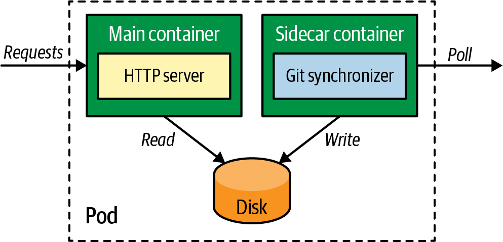
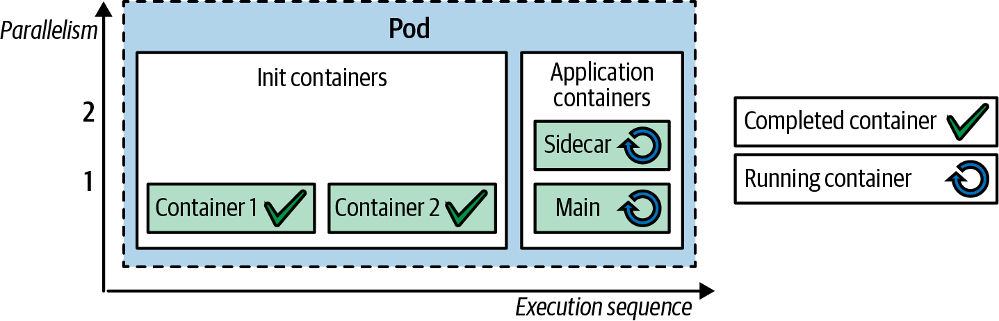
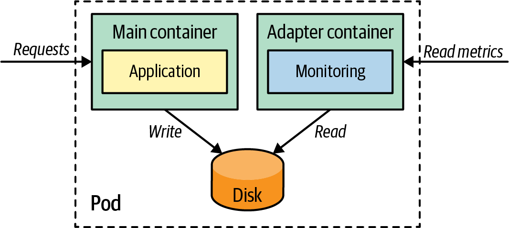
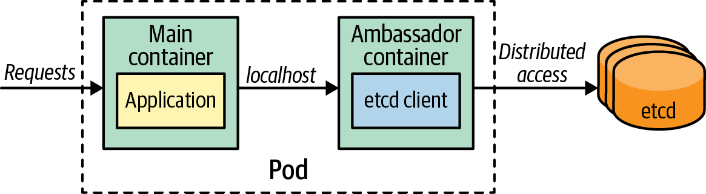

# Pod Patterns in Kubernetes

### Kubernetes Pods:
A Pod is the smallest and simplest unit in the Kubernetes object model. It represents a single instance of a running process in a cluster. Pods are used to deploy and manage containers in Kubernetes.

### Multiple Containers in a Pod:
Kubernetes allows running multiple containers within a single Pod. This can be useful for scenarios where multiple processes need to run together and share resources. There are several mechanisms for using multiple containers in a Pod:

1. Sidecar Pattern
2. Init Container
3. Adapter Pattern
4. Ambassador Pattern 

Note: It's important to carefully design and configure multiple containers in a Pod to ensure proper coordination and resource utilization.


## Sidecar Pattern:
The sidecar pattern involves running an additional container alongside the main container in a Pod. The sidecar container provides additional functionality or support to the main container. For example, a sidecar container can handle logging, monitoring, or data synchronization tasks.



## Init Container:
An init container is a special type of container that runs and completes before the main container starts. Init containers are used for performing initialization tasks such as setting up configuration files, downloading dependencies, or waiting for external services to be available.



## Adapter Pattern:
The adapter pattern involves running a separate container in a Pod that acts as an adapter between the main container and the external system. The adapter container can handle tasks such as data transformation, protocol conversion, or authentication.



## Ambassador Pattern:
The Ambassador pattern is a specialized sidecar responsible for hiding external complexities and providing a unified interface for accessing services outside the Pod. In this chapter, you will see how the Ambassador pattern can act as a proxy and decouple the main container from directly accessing external dependencies. The ambassador container can handle tasks such as routing, load balancing, or service discovery.



### Pod Lifecycle:

A Pod goes through several phases during its lifecycle:

1. Pending: The Pod has been accepted by the Kubernetes system, but one or more of its containers are not yet running.
2. Running: All containers in the Pod are running and at least one container is still running.
3. Succeeded: All containers in the Pod have terminated in success, and will not be restarted.
4. Failed: All containers in the Pod have terminated, and at least one container has terminated in failure.
5. Unknown: The state of the Pod cannot be determined.

### Dive Deep in to Pod scheduling

When pod is schedule in Kubernetes it creates a container in the node. This container use the container runtime to run the container. The container runtime is responsible for running the container and managing its lifecycle. The container runtime interacts with the underlying operating system to create and manage the container.

We can see how the container runtime interacts with the operating system to run the container. The container runtime uses the operating system's kernel features to create and manage the container. The kernel provides the necessary isolation and resource management features to run the container securely and efficiently.

So lets take an example lets schedule a pod
  
  ```bash
  kubectl apply -f kubia-manual.yaml
  ```
then lets take a look in to the container process running in the pod. we can use the following command to get the process running in the container.
  
  ```bash
  kubectl exec kubia-manual -- ps -aux

  USER         PID %CPU %MEM    VSZ   RSS TTY      STAT START   TIME COMMAND
root           1  0.0  0.1 614440 25952 ?        Ssl  20:51   0:00 node app.js
root          18  0.0  0.0  17508  2120 ?        Rs   21:11   0:00 ps -aux
  ```

If you see the above output PID 1 is the main process running in the container. This is the process that was started when the container was created. The container runtime uses the process ID 1 to manage the container and its lifecycle. In this example it runs a node.js application.

Next we will look how this process reflect in the node of the pod running. 

  ```bash
  kubectl get pods -o wide

NAME           READY   STATUS    RESTARTS   AGE   IP           NODE            NOMINATED NODE   READINESS GATES
kubia-manual   1/1     Running   0          38m   10.244.2.2   learn-k8s-m03   <none>           <none>
```

As you can see in the above output the pod is running in the node learn-k8s-m03. Now lets take look at the process runing in the node.

  ```bash
  docker exec learn-k8s-m03 ps -aux

root        3355  0.0  0.1 614440 25952 ?        Ssl  20:51   0:00 node app.js

```

As you can see the process running in the node is same as the process running in the container. This is because the container runtime uses the operating system's kernel features to run the container.


